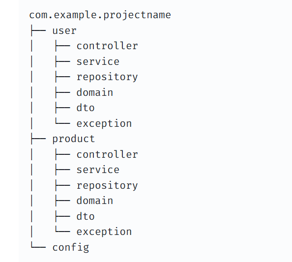
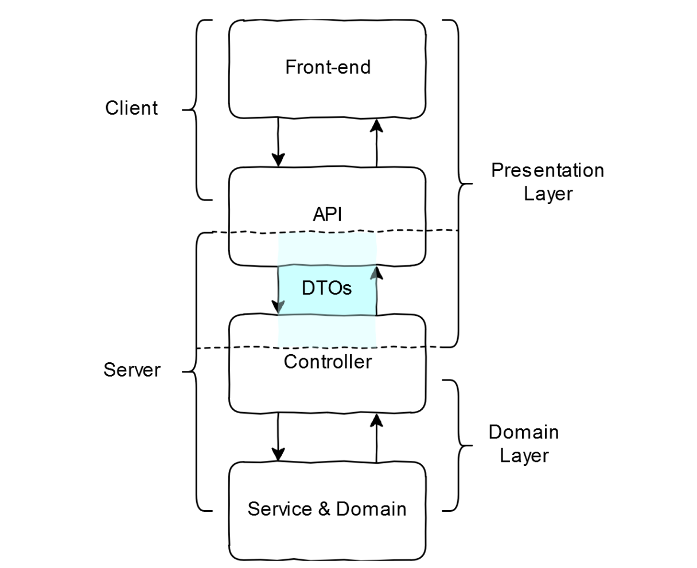

## 아키텍처 구조란?

:**소프트웨어를 어떤 식으로 만들고 구성할지 큰 그림을 그리는 것**

잘 설계된 아키텍처 구조를 프로젝트에 적용한다면..

- 높은 유지보수성과 유연성
- 확장성
- 개발 생산성 및 협업 효율 향상
- 안정성 및 테스트 용이성

**[좋은 아키텍처를 결정하는 3요소]**

1. 모듈화 ⇒ 기능별로 얼마나 잘 나누어져 있는가?
2. 결합도 ⇒ 구성 요소들의 결합도가 낮은가?
3. 응집도 ⇒ 하나의 모듈이 하나의 책임만 명확히 수행하고 있는가?

<br>
**[아키텍처 구조 종류]**

- **Monolithic Architecture (모놀리식 아키텍처)**

  : 모든 애플리케이션 컴포넌트(프론트엔드, 백엔드, 데이터베이스)가 하나의 코드베이스에 통합된 구조.

    - **장점**:
        - 단순하고 초기 개발 및 배포가 빠름.
        - 통합된 환경에서 테스트가 용이.
    - **단점**:
        - 확장성 제한 (수직 확장만 가능).
        - 작은 변경에도 전체 애플리케이션 재배포 필요.
        - 대규모 애플리케이션에서는 유지보수가 어려움.
- **Microservices Architecture (마이크로서비스 아키텍처)**

  **:** 애플리케이션을 **독립적**으로 배포 및 확장 가능한 작은 서비스들로 나누는 구조.

    - **장점**:
        - 서비스별 독립적 배포 및 확장 가능.
        - 각 팀이 독립적으로 개발 및 관리.
        - 특정 기술 스택에 얽매이지 않음.
    - **단점**:
        - 서비스 간 통신 복잡성 증가
        - 데이터 관리와 트랜잭션 처리가 어려움.
        - 모니터링 및 디버깅이 어려움.
- **Layered Architecture (계층형 아키텍처)**

  **:** 애플리케이션을 기능별로 계층화하여 설계 (예: 프레젠테이션, 비즈니스 로직, 데이터 계층).

    - **장점**:
        - 코드 구조가 명확하고 이해하기 쉬움.
        - 각 계층이 독립적으로 개발 가능.
    - **단점**:
        - 계층 간 호출로 인한 성능 저하 가능.
        - 수직적 확장에 제약이 있을 수 있음.
- **Event-Driven Architecture (이벤트 기반 아키텍처)**

  **:** 시스템 컴포넌트가 이벤트를 통해 상호작용. 이벤트가 발생하면 이를 처리하는 리스너(consumer)가 동작.

    - **장점**:
        - 비동기 처리가 가능하여 높은 확장성 제공.
        - 느슨한 결합(loose coupling)으로 유연한 시스템 구축 가능.
    - **단점**:
        - 디버깅과 테스트가 복잡.
        - 메시지 순서 보장이 필요할 수 있음.
- **CQRS (Command Query Responsibility Segregation)**

  : 읽기(Query)와 쓰기(Command)를 분리하여 각각 최적화된 모델로 설계.

    - **장점**:
        - 읽기와 쓰기 성능을 독립적으로 최적화 가능.
        - 복잡한 비즈니스 로직 처리에 유리.
    - **단점**:
        - 설계와 구현이 복잡.
        - 데이터 동기화 문제 발생 가능.
  
<br>

---

## Swagger란?

:REST API를 설계, 빌드, 문서화, 그리고 사용하기 위한 오픈소스 소프트웨어 프레임워크.

⇒ 개발자가 API를 만들면, 그 API의 입력값이 뭔지, 출력 결과값은 뭔지를 다른 사용자가 알 수 있어야 함.(특히 프론트엔드 개발자)

Swagger는 이를 위해 자동으로 시각화된 문서를 만들어주고, 직접 API를 호출해볼 수 있는 테스트 환경을 제공.

**[Swagger의 주요 기능]**

Swagger는 단순히 문서만 만드는 도구가 아니라, API 생명주기 전반에 걸쳐 도움.

- **API 문서 자동화:** 코드에 몇 가지 어노테이션(주석)을 추가하면 API 명세서를 자동으로 생성.
- **Swagger UI:** 생성된 명세서를 웹 브라우저에서 보기 좋게 출력.
- **API 테스트 (Try it out):** Postman 같은 별도의 도구 없이도 웹 페이지상에서 직접 파라미터를 입력해 API를 호출하고 응답을 확인 가능.
- **코드 생성:** API 설계도를 바탕으로 클라이언트 라이브러리나 서버 스텁(Stub) 코드를 자동으로 생성.

**[Swagger를 사용했을 때의 장점]**

- **협업 효율 향상:** 프런트엔드와 백엔드 개발자가 최신 API 정보를 실시간으로 공유 가능.
- **문서의 현행화:** 코드를 수정하면 문서도 함께 업데이트.
- **편리한 테스트:** 별도의 클라이언트 구현 없이도 로직이 잘 작동하는지 즉시 확인 가능.

<br>

---

## 도메인형 아키텍처란?



:도메인에 초점을 맞추어 코드를 구성하는 방식. 관련된 기능들을 도메인 단위로 그룹화.

- **장점**:
    - 특정 도메인의 코드를 한 곳에 모아두기 때문에 코드 탐색이 쉬움.
    - 도메인 단위로 개발하고 유지보수하기 용이.
    - 새로운 도메인 추가 시 다른 곳에 영향을 주지 않음.
- **단점**:
    - 도메인 간의 의존성 관리가 어려울 수 있음.
    - 도메인 간 코드 중복이 발생할 수 있음.

**계층형 vs 도메인형 차이점 비교**

| 구분 | 레이어형 구조 | 도메인형 구조 |
| --- | --- | --- |
| **구조** | 기능별로 패키지를 나눔 | 도메인별로 패키지를 나눔 |
| **장점** | 각 레이어별로 역할이 명확 | 각 도메인별로 모듈화가 잘 되어 있음 |
|  | 코드 중복이 줄어듦 | 각 도메인의 독립성 유지 |
| **단점** | 대규모 프로젝트에서 패키지가 복잡해짐 | 코드 중복이 발생할 수 있음 |
|  | 도메인 간의 의존성이 높아질 수 있음 | 도메인 간의 의존성 관리가 어려울 수 있음 |
| **예시** | `controller`, `service`, `repository` 등 | `user`, `product` 등 도메인 단위로 나눔 |

프로젝트 규모 및 요구사항에 따라 적절한 구조를 선택하는 것이 중요.

⇒

- **레이어형 구조**는 각 레이어별로 역할이 명확하고 코드 중복을 줄이는 데 유리하다. 작은 규모의 프로젝트나 단순한 애플리케이션에 적합.
- **도메인형 구조**는 모듈화가 잘 되어 있어 대규모 프로젝트에서 각 도메인의 독립성을 유지하고, 기능 단위로 개발과 유지보수가 용이.협업에 유리.

<br>

---

## DDD vs 도메인형 아키텍처

| **구분** | **도메인형 아키텍처 (Layered/Hexagonal)** | **DDD (Domain-Driven Design)** |
| --- | --- | --- |
| **성격** | **기술적 구조** 및 패턴 | **설계 철학** 및 사고방식 |
| **목적** | 관심사의 분리, 유연한 코드 구조 | 복잡한 비즈니스 문제 해결, 언어의 통일 |
| **핵심 키워드** | 계층 분리, 의존성 역전(DIP), 포트와 어댑터 | 유비쿼터스 언어, 바운디드 컨텍스트, 애그리거트 |
| **관계** | DDD를 코드로 구현하기 위한 **그릇** | 아키텍처 안에 담길 **내용물**을 결정하는 원칙 |

**도메인형 아키텍처**는 코드를 물리적으로 어디에 배치하고, 계층 간에 어떻게 통신할지에 집중.
**DDD(Domain-Driven Design)**는 에릭 에반스가 제안한 개념으로, 개발자와 비즈니스 전문가가 협력하여 **비즈니스의 복잡성**을 해결하는 데 초점.

**도메인형 아키텍처**는 파일을 *어떻게 구조화하냐*의 문제. (폴더 구조/레이어 구성 방식)
**DDD(Domain-Driven Design)**는 소프트웨어를 *어떻게 설계하냐*의 철학/방법론.

**[DDD의 핵심 키워드]**

| 개념 | 설명 |
| --- | --- |
| Ubiquitous Language | 개발자-도메인 전문가가 동일한 용어 사용 |
| Bounded Context | 도메인 경계를 명확히 정의 |
| Aggregate | 일관성을 보장하는 객체 군집 |

<br>

---

## 왜 DTO를 사용하는가?

**DTO(Data Transfer Object, 데이터 전송 객체):** 프로세스 간에 데이터를 전달하는 객체.
⇒ 주로 클라이언트와 서버가 데이터를 주고받을 때 사용하는 객체.



DTO는 로직없이(코드 등) 순수하게 전달하고 싶은 **데이터만 담고 있음**.

**[DTO를 사용하는 이유]**

1. **보안** (민감 정보 차단)

    ```tsx
    // User Entity
    class User {
      id: number
      email: string
      password: string      // 절대 노출되면 안 됨
      ssn: string           // 주민번호
      internalMemo: string  // 내부 메모
    }
    
    // 응답 DTO — 필요한 것만
    class UserResponseDto {
      id: number
      email: string
      // 나머지는 포함 안 함
    }
    ```

   Entity를 그대로 내보내면 비밀번호, 민감 정보가 API 응답에 실릴 수 있음.

2. **계층 분리** (API 스펙과 DB 구조를 독립적으로)

    ```tsx
    // DB 구조가 바뀌어도
    class User {
    first_name: string   // DB 컬럼명 변경
    last_name: string
    }
    
    // API 응답은 그대로 유지 가능
    class UserResponseDto {
    fullName: string     // DTO에서 조합
    }
    ```

   DB 스키마가 바뀐다고 API가 바뀌지 않아도 됨. **변경의 파급 범위 감소.**

3. **유효성 검증**을 한 곳에서 처리

    ```tsx
    class CreateUserDto {
    @IsEmail()
    @IsNotEmpty()
    email: string
    
    @MinLength(8)
    @Matches(/[A-Z]/)
    password: string
    
    @IsInt()
    @Min(0)
    @Max(150)
    age: number
    }
    ```

   요청 데이터 검증을 DTO에 집중시키면, Service/Controller가 깔끔해짐.


4. **API 응답 형태**를 의도적으로 설계

    ```tsx
    // Entity엔 없는 조합 데이터도 DTO에서 만들 수 있음
    class OrderResponseDto {
    orderId: number
    totalPrice: number          // items 합산 계산값
    itemCount: number           // items.length
    formattedDate: string       // "2026년 4월 3일" 형식으로 가공
    }
    ```

   클라이언트가 원하는 형태로 **가공해서** 줄 수 있음.

5. **문서화 / 명세 역할**

    ```tsx
    // DTO 자체가 API 계약서가 됨
    class CreateOrderDto {
    userId: number       // 필수
    items: ItemDto[]     // 필수
    couponCode?: string  // 선택
    memo?: string        // 선택
    }
    ```

   어떤 데이터를 받고, 어떤 데이터를 주는지 **코드만 봐도 명확.**

<br>

---

## 컨버터는 왜 사용하는가?

⇒ 도메인 모델(Entity)과 데이터 전송 객체(DTO) 사이의 결합도를 완전히 끊기 위해서

1. **단일 책임 원칙 (SRP)**

| 객체 | 책임 |
| --- | --- |
| Controller | 요청/응답 처리 |
| Service | 비즈니스 로직 |
| Repository | DB 접근 |
| **Converter** | **형태 변환만** |

⇒ 하나의 역할만 가지도록. 변환 로직을 분리.

2. **중복 제거**

   컨버터가 없을 경우, 변환 코드가 여러 메서드에 중복.

3. **테스트 용이성**

   변환 로직만 검증 가능.