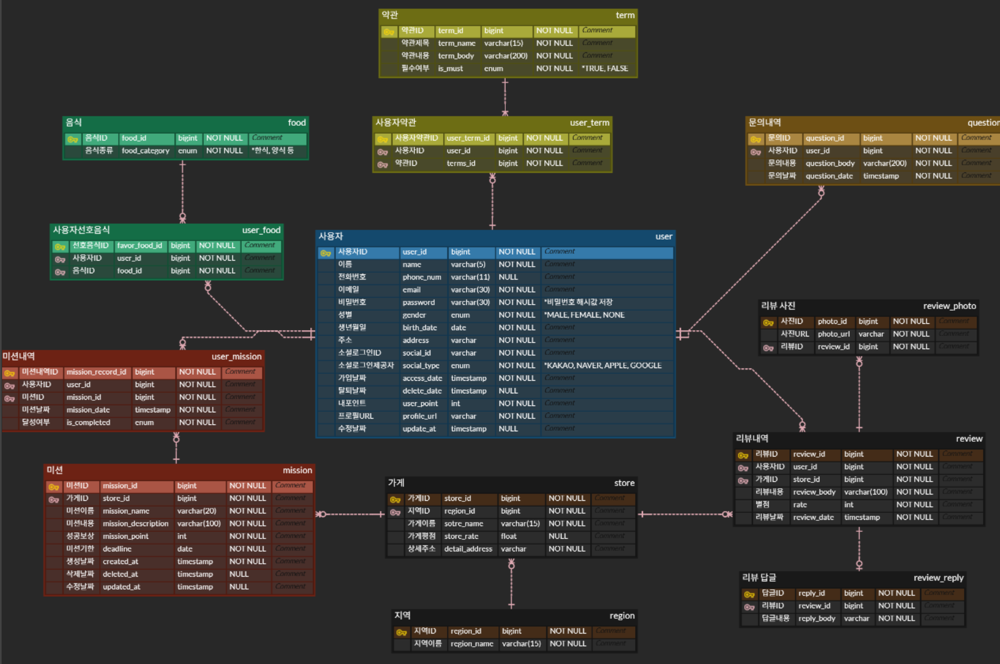

미션 수행한 브랜치
https://github.com/givenhhy012/umc_10th_practice/tree/feature/%235

2주차 API 명세서

erd

**4주차에서 수정한 점**

- Service를 Service와 ServiceImpl로 구분했습니다.

- 홈화면 api를 구성하기 위해 home 도메인을 추가했습니다.

**각 도메인 별 담당하는 api**

**1. home**

- 홈화면 api
    : /api/home
    
    지역 정보, 유저의 포인트, 완료한 미션 수, 미션 정보, 커서 정보를 response로 주도록 response DTO를 구성.

 

**2. mission**
- 미션 목록 조회
    : /api/missions

    지역 정보, 미션 정보, 커서 정보를 주도록 response DTO를 구성.

- 미션 성공 처리
    : /api/missions/{missions-id}

    미션 정보, 성공 여부, 성공 날짜를 주도록 response DTO를 구성.

 

**3. review**
- 리뷰 작성
    : /api/stores/{stores-id}/reviews

    리뷰 정보, 리뷰 날짜를 주도록 response DTO를 구성.

 

**4. user**
- 마이페이지
    : /api/users/me

    유저 정보를 주도록 response DTO를 구성.

- 회원 가입
    : /api/auth/users

    유저 아이디, 생성 날짜를 주도록 response DTO를 구성.

- 로그인
    : /api/auth/login

    유저 아이디, 이름을 주도록 response DTO를 구성.