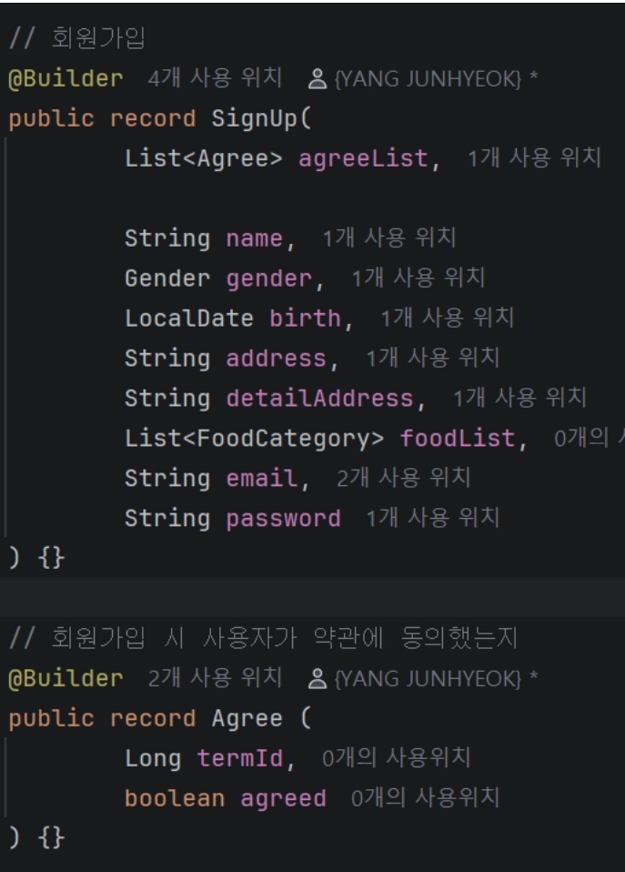
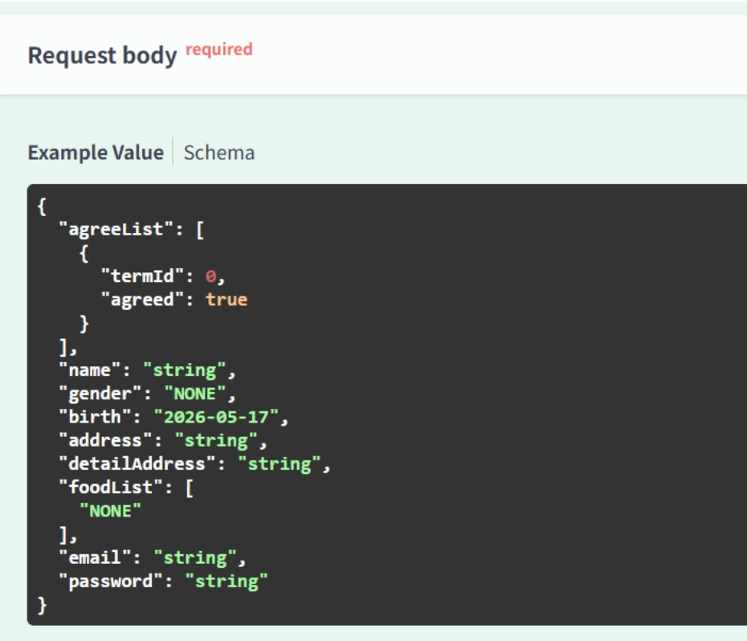
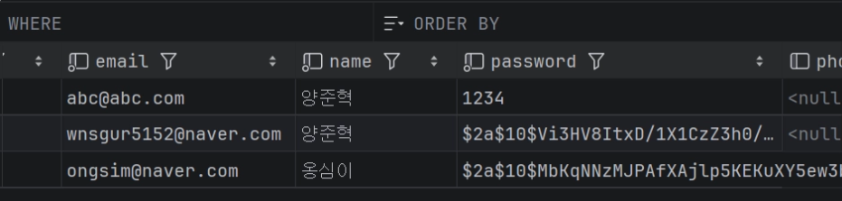
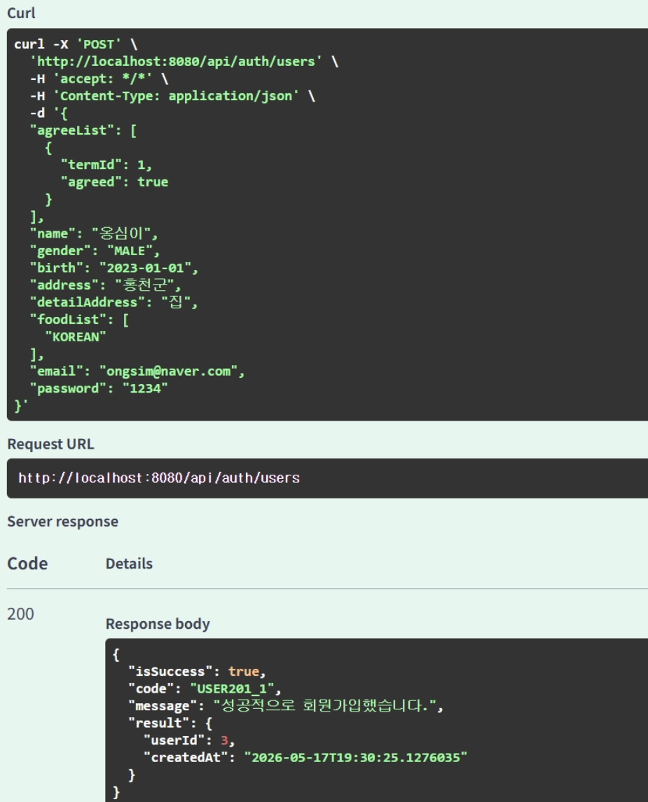

1. 회원가입 API 구현



기존의 회원가입 ReqDTO를 약관 동의여부도 처리할 수 있게끔 수정.
⇒ 사용자가 동의/동의하지 않은 약관의 id를 리스트로 받아서 처리하도록 설계.

Swagger에서의 리퀘스트 바디 모습.



UserServiceImpl.java 에서의 약관 검사 부분

```java
				// 리퀘스트 바디로 받은 약관의 id가 존재하는 약관인지 검사
        List<Long> requestedTermIds = request.agreeList().stream()
                .map(UserReqDTO.Agree::termId)
                .toList();

        List<Long> existsTermIds = termRepository.findAll().stream()
                .map(Term::getId)
                .toList();

        if(!existsTermIds.containsAll(requestedTermIds))
            throw new UserException(UserErrorCode.TERM_NOT_FOUND);

        // 필수 약관 동의 여부 검증
        List<Long> agreedTermIds = request.agreeList().stream()
                .filter(UserReqDTO.Agree::agreed)
                .map(UserReqDTO.Agree::termId)
                .toList();

        List<Long> requiredTermIds = termRepository.findByIsMust(TermIsMust.MUST).stream()
                .map(Term::getId)
                .toList();

        if(!agreedTermIds.containsAll(requiredTermIds))
            throw new UserException(UserErrorCode.TERM_NOT_AGREED);

```

패스워드는 PasswordEncoder이용하여 인코딩되어 저장.

```java
// 유저 생성
        String encodedPassword = passwordEncoder.encode(request.password());
        User user = UserConverter.toUserEntity(request, encodedPassword);
        userRepository.save(user);
```

비밀번호가 성공적으로 솔트 처리되어 DB에 저장되어있는 모습.



(첫 번째 행이 솔트 처리해주기 전의 회원가입 API로 가입했을 때의 모습. 2, 3번째 행이 솔트 처리 해준 후의 모습.)

회원가입 성공 시의 결과화면


