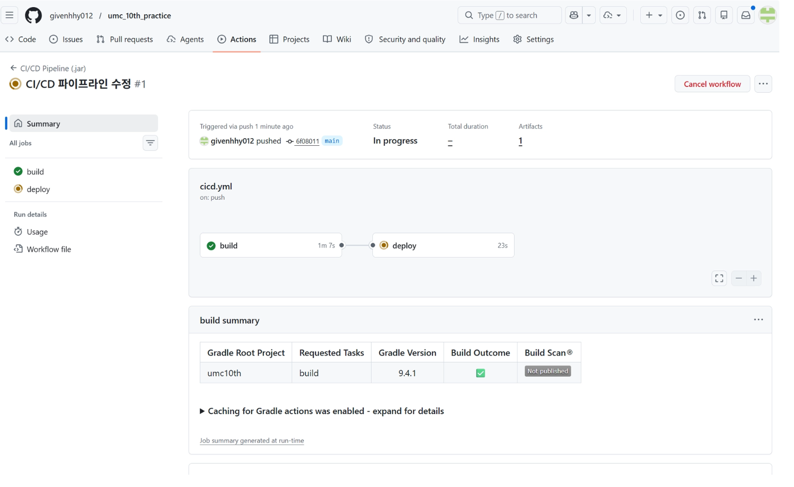
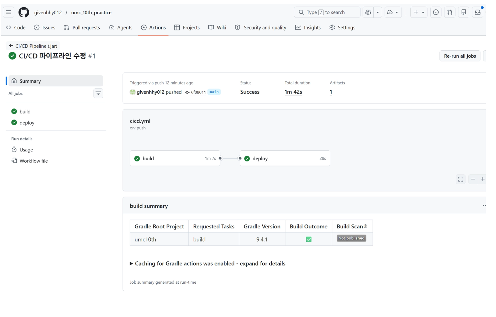
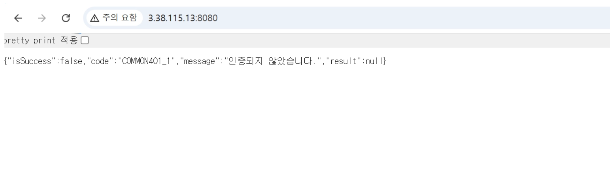
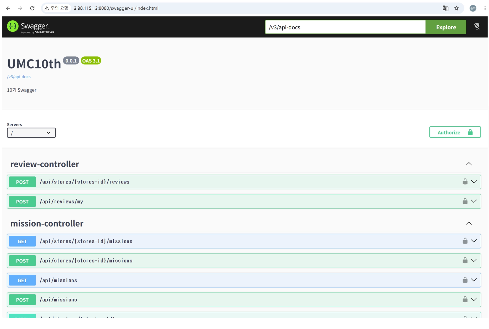
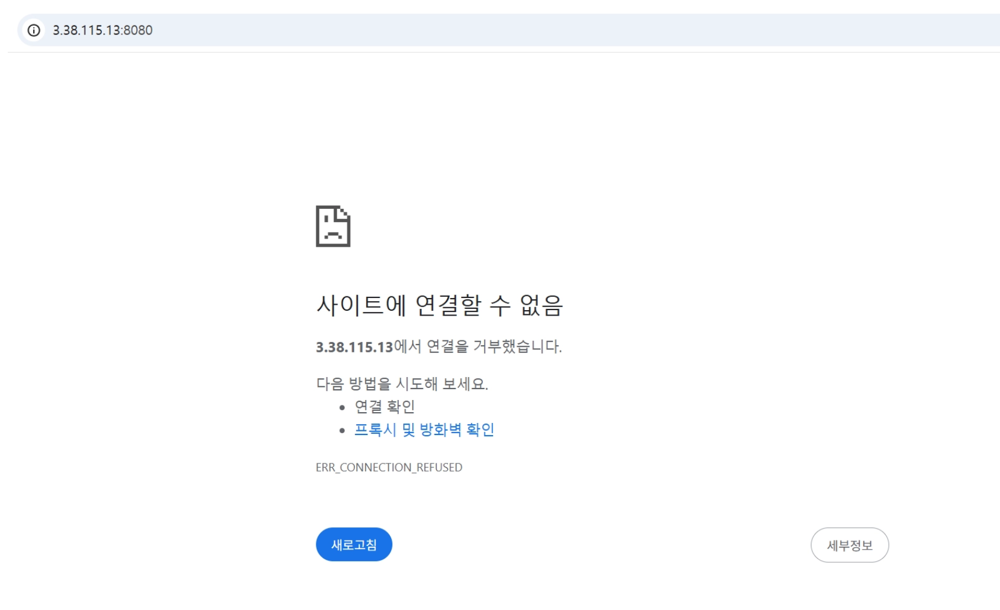

미션 진행한 브랜치

https://github.com/givenhhy012/umc_10th_practice/tree/feature/%2310

해당 브랜치에서 코드 작성 진행했으나, 파이프라인 액션 돌리는 것은 메인 브랜치로 돌아가게끔 코드에 명시되어있어 메인 브랜치로 merge하여 진행했다.

워크북을 따라서 배포를 해보았다.

EC2 인스턴스 생성, 깃 워크플로우 등록 및 시크릿 액션 설정 등등을 거쳐 깃허브에서 파이프라인이 정상적으로 돌아가는 것을 확인했고,





접속했을때 JWT인증되지 않은 상태이기 때문에 인증되지 않았다는 서버의 에러 메시지 모습.



`allowUris` 로 등록해둔 스웨거 화면으로 접속하여 정상적으로 확인가능했다.



+EC2인스턴스 생성을 처음해보았던지라 좀 헤맸다.(지역 설정 잘못 한것 등등.. 인스턴스 생성 삭제만 세 번 한 것 같다.)

+깃허브 액션탭에서 파이프라인은 정상적으로 빌드 및 디플로이 되었는데 접속해보았을때 아래와 같이 연결을 거부했다는 에러가 뜨는 이슈가 있었다.



어떤 오류가 발생했는지 찾아보기 위해

터미널에 다음 명령어를 입력해 로그를 살펴보았다.

```bash
cat app.log
```

`Access denied for user 'root'@'localhost'`
로그를 통해 다음과 같은 메시지를 볼 수 있었고, 이는 환경변수(시크릿)으로 등록했던 DB_PW가 틀렸거나, 권한이 없어서 발생하는 오류라고 한다.

그래서 전용 계정을 새로 만들어서 했다.

```sql
CREATE USER '{유저이름}'@'localhost' IDENTIFIED BY '{비밀번호}';
GRANT ALL PRIVILEGES ON umc10th.* TO '{유저이름}'@'localhost';
FLUSH PRIVILEGES;
EXIT;
```

이후, 업데이트된 계정 토대로 깃허브 시크릿을 업데이트 해준 뒤, 액션탭에서 Re-run all jobs를 해주어서 성공할 수 있었다.